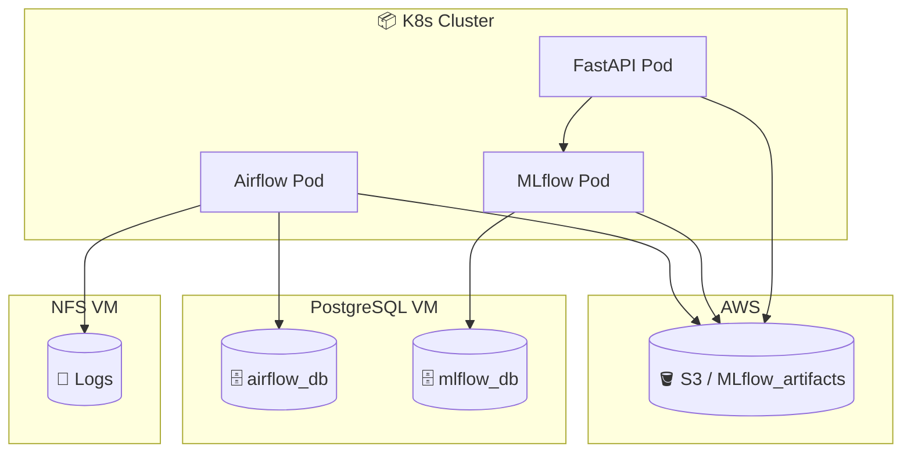

+++
date = '2025-06-23T17:11:47+09:00'
draft = false
title = '[MLOps 플랫폼 구축 - 1단계: 인프라 설계 및 환경 준비]'
categories = ['NFS', 'PostgreSQL', 'AWS', 'Kubernetes']
+++

## ✨ TL;DR

- **단순한 ML 파이프라인 구성**을 넘어서, **인프라 설계부터 구축까지** 진행
- MLflow, Airflow, FastAPI를 로컬 쿠버네티스 위에서  구성, 실무에서 사용 가능한 구조를 직접 설계/구현
- 이번 포스팅에서는 **MLOps 인프라 전체 구조**, 그리고 그 기반이 되는 NFS 서버, PostgreSQL, S3 버킷, Kubernetes 클러스터 환경 공유

---

## 🧱 아키텍처 구성도



---

## 🔧 인프라 설계 개요

| 구성 요소 | 설명 |
| --- | --- |
| Kubernetes 클러스터 | 로컬 환경 (VMware) 기반. Helm & Ingress 활용 |
| MLflow 서버 | 외부 PostgreSQL + S3 연동. 모델 등록, 추적, 아티팩트 관리 |
| Airflow 서버 | DAG GitSync + S3 연동 + PostgreSQL 외부 DB 사용 |
| FastAPI 서버 | MLflow 모델 호출용 예측 API. Ingress로 외부 노출 |
| NFS 서버 | Airflow 로그 저장소로 사용. PVC로 연결됨 (S3 가능하지만, pvc 테스트) |
| AWS S3 | MLflow 아티팩트 저장소로 활용 |
| PostgreSQL | MLflow & Airflow의 metadata 저장소. 외부 VM에서 호스팅됨 |

---

## 📂 NFS 서버 구성

### ✅ 설치 & 공유 디렉토리 생성 (Ubuntu 기준)

```bash
sudo apt update
sudo apt install -y nfs-kernel-server

sudo mkdir -p /mnt/nfs_share/mlops/airflow/logs
sudo chown -R 50000:root /mnt/nfs_share/mlops/airflow  # 사용할 유저 UID, GID 확인 필요
sudo chmod -R 775 /mnt/nfs_share/mlops/airflow
```

### 📄 `/etc/exports` 설정

```bash
# 마운트 수가 적은 경우 (프로덕션 환경 적용시 root_squash 권장)
/mnt/nfs_share/mlops/airflow/logs  192.168.18.0/24(rw,sync,no_subtree_check,root_squash)

# 마운트 수가 많은 경우 (필요시)
/mnt/nfs_share/mlops 192.168.18.0/24(rw,sync,no_subtree_check,root_squash)
```

```bash
# 적용
sudo exportfs -rav
sudo systemctl restart nfs-kernel-server
```

📄 PV&PVC 설정

```bash
# cat airflow-logs-pv.yaml
apiVersion: v1
kind: PersistentVolume
metadata:
  name: airflow-logs-pv
spec:
  capacity:
    storage: 5Gi
  accessModes:
    - ReadWriteMany
  nfs:
    server: 192.168.18.141
    path: /mnt/nfs_share/mlops/airflow/logs
  persistentVolumeReclaimPolicy: Retain
---
apiVersion: v1
kind: PersistentVolumeClaim
metadata:
  name: airflow-logs-pvc
  namespace: airflow
spec:
  accessModes:
    - ReadWriteMany
  resources:
    requests:
      storage: 5Gi
      
      

# 적용
kubectl apply -f airflow-logs-pv.yaml
```

---

## 🗄 PostgreSQL 외부 DB 구성

### ✅ 설치 및 사용자/DB 생성

```bash
sudo apt install postgresql -y
sudo -u postgres psql
```

```sql
-- 데이터베이스 생성
CREATE DATABASE airflow_db;
CREATE DATABASE mlflow_db;

-- DB별 사용자 생성
CREATE USER airflow_user WITH PASSWORD 'airflow1234';
CREATE USER mlflow_user WITH PASSWORD 'mlflow1234';

-- DB별 권한 부여
GRANT ALL PRIVILEGES ON DATABASE airflow_db TO airflow_user;
GRANT ALL PRIVILEGES ON DATABASE mlflow_db TO mlflow_user;
```

### 🔐 외부 접속 허용

- `/etc/postgresql/14/main/postgresql.conf`

```
listen_addresses = '*'
```

- `/etc/postgresql/14/main/pg_hba.conf`

```
host    airflow_db     airflow_user     192.168.18.0/24   scram-sha-256
host    mlflow_db      mlflow_user      192.168.18.0/24   scram-sha-256
```

```bash
sudo systemctl restart postgresql
```

---

## 🪣 S3 버킷 준비 (MLflow 아티팩트 저장소)

### ✅ AWS S3 버킷 생성

- 버킷 이름: `mlflow-artifacts-keonho`
- 리전: `ap-northeast-2`
- 퍼블릭 차단 유지, 기본 암호화 사용

### ✅ IAM 사용자 생성 및 권한 부여

- 이름: `mlflow-airflow-user`
- 권한: `AmazonS3FullAccess` (실습용)
- `AWS_ACCESS_KEY_ID` / `AWS_SECRET_ACCESS_KEY` 저장

---

## 🧩 Tip

- `NFS`는 여러 Pod에서 로그나 파일을 공유해야 할 때, PVC로 연결해두면 관리가 쉬움
- `PostgreSQL`을 외부 DB로 쓰면 Helm chart 배포 때 내부 DB 설정을 꺼야 함 (`enabled: false`)
- `AWS S3`는 반드시 **환경변수 방식** 또는 **마운트 방식**으로 보안 설정할 것 (실무에서 `.aws/credentials`는 최소화)

---

## 🔧 MLOps 실전 연결

| 구성 요소 | 실전 적용 사례 |
| --- | --- |
| NFS 서버 | Airflow 로그 공유 → DAG 실패 로그 분석 가능 |
| PostgreSQL 외부 연동 | MLflow/Airflow 확장 시 **DB 성능 모니터링**과 연결됨 |
| S3 아티팩트 저장 | 모델 버전 관리 + 대용량 저장소 활용 (모델 서빙 시 URI로 접근 가능) |

---

## 🧭 다음 포스트 예고

> 🔐 S3 & PostgreSQL 연동을 위한 보안 구성 및 Secret 관리
> 
> 
> → 실제로 AWS 키와 DB URI를 어떻게 Kubernetes 환경에서 안전하게 관리하고 주입하는지, Helm에서 어떻게 다루는지 작성할 예정입니다.
>
