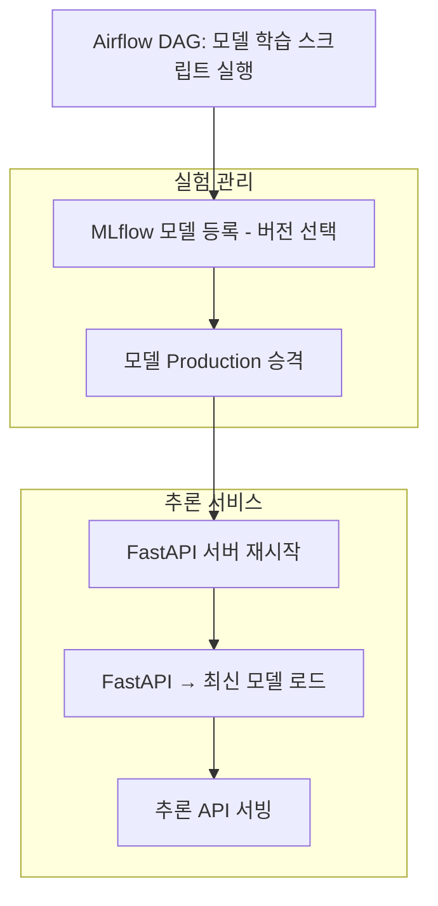

+++
date = '2025-07-10T17:12:00+09:00'
draft = false
title = '[MLOps 플랫폼 구축 - 6단계: 실시간 모델 핫스왑 구조 실험]'
categories = ['MLOps Pipeline', 'Airflow', 'MLflow', 'FastAPI', 'NFS', 'PostgreSQL', 'AWS', 'Kubernetes', 'Helm', 'Git', '']
+++

## ✅ TL;DR

- `Airflow`에서 선택한 모델 버전에 따라 학습 스크립트를 다르게 실행
- 학습된 모델을 `MLflow Model Registry`에 등록 → Production 단계로 자동 승격
- `FastAPI` 서버는 `Production 모델`을 다시 로드 → 별도 코드 수정 없이 핫스왑 완료
- 실무에서 모델 검증/배포 사이클 자동화에 바로 응용 가능

---

## 🧠 구조 다이어그램 (핫스왑 흐름)



---

## 🧩 핵심 구성 요소

### 1. Airflow DAG - 모델 버전 선택

```python
# dags/train_promote_pipeline_share.py
from airflow import DAG
from airflow.operators.bash import BashOperator
from airflow.models import Variable
from datetime import datetime

default_args = {
    'start_date': datetime(2023, 1, 1),
}

with DAG(
    dag_id='train_promote_pipeline_share',
    default_args=default_args,
    schedule=None,
    catchup=False,
    tags=["ml", "train"]
) as dag:

    # moedel_version 변수 default_var 지정
    model_version = Variable.get("model_version", default_var="v1")

    debug_aws = BashOperator(
    task_id='debug_aws_credentials',
    bash_command='echo $HOME && ls -al $HOME/.aws && cat $HOME/.aws/credentials',
    env={"HOME": "/home/airflow"},
    )

    run_train_script = BashOperator(
        task_id='run_train_script',
        # merdel_version 변수화
        bash_command=f'python /opt/airflow/dags/repo/ml_code/train_model_{model_version}.py',
        env={"HOME": "/home/airflow"},
    )

    promote_model = BashOperator(
        task_id='promote_model_to_production',
        bash_command='python /opt/airflow/dags/repo/ml_code/promote_model.py',
        env={"HOME": "/home/airflow"},
    )

    debug_aws >> run_train_script >> promote_model

```

→ `Airflow UI > Admin > Variables` 에서 `model_version = v1` 또는 `v2` 설정 가능

---

### 2. 모델 학습 스크립트 (v1 & v2 비교)

```python
# train_model_v1.py
import mlflow
import mlflow.sklearn
from sklearn.linear_model import LogisticRegression
from sklearn.datasets import load_iris
from sklearn.model_selection import train_test_split

X, y = load_iris(return_X_y=True)
X_train, X_test, y_train, y_test = train_test_split(X, y)

model = LogisticRegression(max_iter=10, C=0.1)  # underfit 유도
model.fit(X_train, y_train)

mlflow.set_tracking_uri("http://mlflow-service.mlflow.svc.cluster.local:5000")
mlflow.set_experiment("train_model_to_s3_and_promote_exp")

with mlflow.start_run() as run:
    mlflow.log_param("model_type", "logistic_regression")
    mlflow.log_metric("accuracy", model.score(X_test, y_test))

    mlflow.sklearn.log_model(
        sk_model=model,
        artifact_path="model",
        registered_model_name="my_model"
    )

    print(f"Logged data and model in run {run.info.run_id}")

# train_model_v2.py
import mlflow
from sklearn.datasets import load_iris
from sklearn.linear_model import LogisticRegression
from sklearn.model_selection import train_test_split

mlflow.set_tracking_uri("http://mlflow-service.mlflow.svc.cluster.local:5000")
mlflow.set_experiment("train_model_to_s3_and_promote_exp")

X, y = load_iris(return_X_y=True)
X_train, X_test, y_train, y_test = train_test_split(X, y, random_state=42)

model = LogisticRegression(max_iter=500, C=10.0, solver="liblinear")  # well-trained
model.fit(X_train, y_train)

with mlflow.start_run() as run:
    accuracy = model.score(X_test, y_test)
    mlflow.log_param("model_type", "logistic_regression")
    mlflow.log_metric("accuracy", accuracy)

    mlflow.sklearn.log_model(
        sk_model=model,
        artifact_path="model",
        registered_model_name="my_model"  # 🔁 같은 모델 이름으로 등록 → v2로 올라감
    )

    print(f"✅ New version logged with accuracy: {accuracy}")
    print(f"📦 Run ID: {run.info.run_id}")

```

→ 두 스크립트는 성능 차이가 확실히 나도록 설정 (핫스왑 검증을 위한 의도적 설계)

---

### 3. 모델 등록 및 승격

```python
mlflow.sklearn.log_model(
    sk_model=model,
    artifact_path="model",
    registered_model_name="my_model"  # 동일한 이름으로 등록 → 버전만 올라감
)
```

→ 같은 모델 이름(`my_model`)으로 등록되기 때문에 버전만 올라가고

→ `Stage: Production`으로 바로 승격됨

---

### 4. FastAPI - 모델 로딩

```python
# 모델 정보 확인
curl http://fastapi.local/model-info | jq
```

```json
{
  "model_name": "my_model",
  "stage": "Production",
  "version": "1",
  "run_id": "4e35d28e73474542b01bad641f603b88",
  "model_uri": "models:/my_model/Production"
}
```

→ `model_uri = models:/my_model/Production` 이므로 자동으로 최신 버전을 가져옴

---

### 5. FastAPI 재시작만으로 핫스왑 적용

```bash
kubectl rollout restart deployment/fastapi-server -n fastapi
```

→ 코드 수정 없이도 새로운 모델 버전이 적용됨

---

### 🔄 **새로운 모델 버전 확인**

```bash
curl http://fastapi.local/model-info | jq
```

- **출력 예시**:
    
    ```json
    {
      "model_name": "my_model",
      "stage": "Production",
      "version": "2",
      "run_id": "01bf8cf78cd64b759c9f5469c65708a4",
      "model_uri": "models:/my_model/Production"
    }
    ```
    

---

## 🔧 MLOps 실전 연결

| 항목 | 실무 활용 포인트 |
| --- | --- |
| Airflow Variable | 파라미터 튜닝 실험 자동화 |
| 모델 버전 관리 | 실험 버전 기록 + 리그레이션 테스트 |
| FastAPI 재시작 | 블루그린 or 롤링 서빙 방식 연계 가능 |
| MLflow + FastAPI 연결 | 코드 변경 없이도 최신 모델 반영 (모델 URI 활용) |

---

## 🧩 Tip

- FastAPI는 `models:/model_name/Production` URI만 유지후 재시작시 신규 모델 버전 적용됨
- `Airflow Variable`을 통해 실시간 실험 환경 구성 가능 → 배포 코드 재작성 필요 없음
- `train_model_v1.py`, `train_model_v2.py`를 통합하고 싶다면 Jinja 템플릿 or 파라미터화 가능
- CI/CD와 연결 시 `model_version` → Git 커밋 태그 등으로 연동하여 버전 자동 추적 가능

---

## 🚨 트러블슈팅

| 이슈 | 해결 방법 |
| --- | --- |
| FastAPI에서 500 오류 | 모델 로드 실패 여부 로그 확인 (`kubectl logs`) |
| 모델 버전이 안 바뀜 | MLflow 등록 후 `Production` 승격 확인 필요 |
| FastAPI 재시작 효과 없음 | `kubectl rollout restart` 명령으로 강제 적용 권장 |
