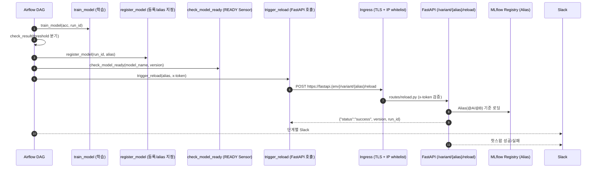

+++
date = '2025-07-22T12:10:21+09:00'
draft = false
title = '[MLOps 운영 고도화 - 1단계: 핫스왑 고도화 (/reload 보안·DAG 자동화)]'
categories = ['MLOps Pipeline', 'FastAPI', 'MLflow', 'Airflow', 'Kubernetes', 'Helm']
+++

## 핫스왑 고도화: `/reload` 보안 강화 + DAG 자동화 연동

---

## 🧠 시나리오 설명

> “모델을 잘 학습시키는 것도 중요하지만,
> 
> 
> 잘못된 모델이 실수로 핫스왑되는 순간이 더 치명적입니다.”
> 
> 그래서 1단계에서는 `/reload`를 확실하게 잠그고,
> 
> **학습 → 등록 → 감시 → 핫스왑**까지가 Airflow에서 자동으로 흘러가도록 만들었습니다.
> 
> 이 단계가 완성돼야 이후 단계에서 **안전한 자동 운영(MLOps)**을 구현할 수 있기 때문입니다.
> 

---

## 🎯 핵심 요약

- **보안 3종**: `x-token`(SealedSecret) + Ingress **IP whitelist** + **TLS**
- **자동화**: Airflow **Train → Register → Sensor(READY) → Reload** 전체 시퀀스
- **일관성**: MLflow **Alias(@A/@B)** 기반 등록·조회·핫스왑
- **관제**: 모든 단계 **성공/스킵/실패** Slack 알림

> 환경 분리: dev(*.local) / prod(*.prod) — 예: fastapi.local, fastapi.prod
> 

---

## 1️⃣ 아키텍처 플로우



---

## 2️⃣ FastAPI `/reload` 보안 라우트

```python
# charts/fastapi/app/routes/reload.py
import secrets
from fastapi import APIRouter, HTTPException, Header, Request
from core.config import settings
from services.model_loader import load_model_by_alias
from utils.slack_alerts import send_slack_alert

router = APIRouter()

@router.post("/variant/{alias}/reload")
def reload_model(request: Request, alias: str, x_token: str = Header(...)):
    expected = settings.reload_secret_token
    if not expected:
        raise HTTPException(status_code=500, detail="서버 설정 오류: 인증 토큰 미설정")

    if not secrets.compare_digest(x_token, expected):
        raise HTTPException(status_code=403, detail="Access denied")

    loaded = load_model_by_alias(alias)
    if not loaded:
        raise HTTPException(status_code=500, detail="모델 로딩 실패")

    request.app.state.models[alias] = loaded
    info = loaded["info"]
    send_slack_alert(
        f"🔁 [FastAPI] 모델 {alias} 핫스왑 완료: v{info['version']}, run_id={info['run_id']}"
    )
    return {"status": "success", "variant": alias, "version": info["version"], "run_id": info["run_id"]}
```

---

## 3️⃣ Airflow DAG (Train → Register → Sensor → Reload)

```python
# dags/dag_ml_train_register_reload.py
from airflow import DAG
from airflow.operators.python import PythonOperator, BranchPythonOperator
from airflow.sensors.python import PythonSensor
from airflow.utils.trigger_rule import TriggerRule
from airflow.exceptions import AirflowSkipException
from airflow.models import Variable
from datetime import datetime, timedelta
from pendulum import timezone

from ml_code.train_model import train_model
from ml_code.register_model import register_model
from ml_code.rollback_model import rollback_model
from ml_code.trigger_reload import trigger_reload
from ml_code.sensor_model_ready import check_model_ready
from utils.slack_alerts import send_slack_alert, alert_slack
from mlflow.tracking import MlflowClient

kst = timezone("Asia/Seoul")
default_args = {"start_date": datetime(2025, 1, 1, tzinfo=kst), "retries": 1, "retry_delay": timedelta(minutes=2)}

def get_param(key, default, cast, validate=None):
    try:
        val = cast(Variable.get(key, default=str(default)))
        if validate and not validate(val):
            raise ValueError("Validation failed")
        return val
    except Exception as e:
        send_slack_alert(f"[Param] {key} 로딩 실패: {e} → 기본 {default} 사용")
        return default

def get_version_by_alias(model_name, alias):
    try:
        return MlflowClient().get_model_version_by_alias(model_name, alias).version
    except Exception:
        return None

def train_and_evaluate(ti, **_):
    C = get_param("logreg_C", 1.0, float, lambda x: 0.001 <= x <= 10.0)
    max_iter = get_param("logreg_max_iter", 200, int, lambda x: x > 50)
    threshold = get_param("accuracy_threshold", 0.9, float, lambda x: 0.5 <= x <= 0.99)
    model_name = Variable.get("model_name")
    alias = Variable.get("mlflow_alias")
    if not (model_name and alias):
        raise ValueError("필수 Variable 누락: model_name 또는 mlflow_alias")

    acc, run_id = train_model(C=C, max_iter=max_iter)
    if not run_id:
        raise ValueError("run_id 없음 → 학습 실패")

    for k, v in {"run_id": run_id, "model_name": model_name, "alias": alias, "acc": acc, "threshold": threshold}.items():
        ti.xcom_push(key=k, value=v)

def check_result(ti, **_):
    acc = ti.xcom_pull(task_ids="train_and_evaluate", key="acc")
    thr = ti.xcom_pull(task_ids="train_and_evaluate", key="threshold")
    if acc is None or thr is None:
        send_slack_alert("❌ check_result → XCom 누락")
        raise AirflowSkipException()
    return "register_model" if acc >= thr else "notify_failure"

def register_model_task(ti, **_):
    run_id = ti.xcom_pull(task_ids="train_and_evaluate", key="run_id")
    model_name = ti.xcom_pull(task_ids="train_and_evaluate", key="model_name")
    alias = ti.xcom_pull(task_ids="train_and_evaluate", key="alias")
    prev = get_version_by_alias(model_name, alias)

    try:
        version = register_model(run_id, model_name, alias)
        ti.xcom_push(key="version", value=version)
        send_slack_alert(f"✅ 등록 완료: {model_name} v{version} → @{alias} (run_id={run_id})")
    except Exception as e:
        msg = f"❌ 등록 실패: {e}"
        if prev:
            rollback_model(model_name, prev, alias)
            msg += f" → 롤백 v{prev}"
        else:
            msg += " → 롤백 생략"
        send_slack_alert(msg)
        raise

def sensor_ready_func(ti, **_):
    model_name = ti.xcom_pull(task_ids="train_and_evaluate", key="model_name")
    version = ti.xcom_pull(task_ids="register_model", key="version")
    return check_model_ready(model_name, version)

def trigger_reload_task(ti, **_):
    alias = ti.xcom_pull(task_ids="train_and_evaluate", key="alias")
    try:
        resp = trigger_reload(alias)  # {"status":"success", ...} 기대
        send_slack_alert(f"🔁 핫스왑 완료: @{alias} → {resp}")
    except Exception as e:
        send_slack_alert(f"❌ 핫스왑 실패: {e}")
        raise

def notify_failure():
    send_slack_alert("⚠️ 기준 미달 → 등록/핫스왑 생략")

with DAG(
    dag_id="ml_train_register_and_reload",
    default_args=default_args,
    schedule=None,
    catchup=False,
    tags=["mlops", "train", "sensor", "reload"],
    on_failure_callback=alert_slack,
) as dag:
    train = PythonOperator(task_id="train_and_evaluate", python_callable=train_and_evaluate)
    branch = BranchPythonOperator(task_id="check_result", python_callable=check_result)
    register = PythonOperator(task_id="register_model", python_callable=register_model_task)
    sensor = PythonSensor(task_id="check_model_ready", python_callable=sensor_ready_func, poke_interval=10, timeout=180, mode="reschedule")
    reload = PythonOperator(task_id="trigger_reload", python_callable=trigger_reload_task, trigger_rule=TriggerRule.ALL_SUCCESS)
    failure = PythonOperator(task_id="notify_failure", python_callable=notify_failure, trigger_rule=TriggerRule.NONE_FAILED_MIN_ONE_SUCCESS)

    train >> branch
    branch >> [register, failure]
    register >> sensor >> reload
```

---

## 4️⃣ Airflow → FastAPI 호출 (Ingress 경유)

```python
# ml_code/trigger_reload.py
import os, requests
from airflow.models import Variable

def trigger_reload(alias: str):
    base = (
        os.getenv("FASTAPI_RELOAD_URL")
        or os.getenv("FASTAPI_BASE_URL")
        or Variable.get("FASTAPI_RELOAD_URL", default_var=None)
        or Variable.get("FASTAPI_BASE_URL")
    )
    token = os.getenv("RELOAD_SECRET_TOKEN") or Variable.get("RELOAD_SECRET_TOKEN")
    url = f"{base}/variant/{alias}/reload"

    # self-signed 환경이면 신뢰 루트 구성 또는 verify=False
    verify = not url.startswith("https://") or os.getenv("ALLOW_SELF_SIGNED") != "true"

    r = requests.post(url, headers={"x-token": token}, timeout=10, verify=verify)
    r.raise_for_status()
    data = r.json()
    if data.get("status") != "success":
        raise RuntimeError(f"Reload failed: {data}")
    return {"alias": alias, "version": data.get("version"), "run_id": data.get("run_id")}
```

---

## 5️⃣ Helm/값 요약 (dev/prod)

### ▶ FastAPI (env)

- `MLFLOW_TRACKING_URI`:
    - dev: `http://mlflow-dev-service.mlflow-dev.svc.cluster.local:5000`
    - prod: `http://mlflow-prod-service.mlflow-prod.svc.cluster.local:5000`
- `MODEL_NAME=best_model`
- `ALIAS_SELECTION_MODE` / `DEFAULT_ALIAS` / `CANARY_PERCENT`
- `envFrom`: `aws-credentials-secret`, `fastapi-token-*-secret`, `slack-webhook-*-secret`

### ▶ Airflow (env/variables)

- `FASTAPI_RELOAD_URL`
    - dev: `https://fastapi.local`
    - prod: `https://fastapi.prod`
- `AIRFLOW__WEBSERVER__WEB_SERVER_BASE_URL`
    - dev: `http://airflow.local`
    - prod: `http://airflow.prod`
- `MLFLOW_TRACKING_URI`
    - dev: `http://mlflow-dev-service.mlflow-dev.svc.cluster.local:5000`
    - prod: `http://mlflow-prod-service.mlflow-prod.svc.cluster.local:5000`
- Airflow Variables:
    
    `model_name`, `mlflow_alias`, `logreg_C`, `logreg_max_iter`, `accuracy_threshold`
    

---

## 6️⃣ Slack 알림 표준

| 구분 | 발생 시점 | 메시지 필드(예시) |
| --- | --- | --- |
| 학습 기준 미달 | `notify_failure` | `acc`, `threshold` |
| 등록 성공/실패 | `register_model_task` | `model`, `version`, `@alias`, `run_id`, (실패 시 롤백) |
| 센서 | `check_model_ready` | `status` (READY/FAILED_REGISTRATION) |
| 핫스왑 | `trigger_reload` & FastAPI | `alias`, `version`, `run_id` |
| 전역 실패 | `on_failure_callback` | `dag_id`, `task_id`, `log_url` |

---

## 7️⃣ 검증 명령

```bash
# Ingress(화이트리스트/TLS/host)
kubectl -n fastapi-dev get ing -o yaml | egrep 'ingressClassName|whitelist-source-range|host:'

# Airflow → FastAPI 호출 환경
NS=airflow-dev
POD=$(kubectl -n $NS get po -l component=scheduler -o name | head -1)
kubectl -n $NS exec $POD -- printenv | egrep 'FASTAPI_RELOAD_URL|RELOAD_SECRET_TOKEN|AIRFLOW__WEBSERVER__WEB_SERVER_BASE_URL'

# 핫스왑 호출
curl -sk -X POST https://fastapi.local/variant/B/reload -H "x-token: <RELOAD_SECRET_TOKEN>"
```

---

## 🏁 정리

> /reload 보안 3종 + DAG 자동화가 하나의 표준 플로우로 정착되었습니다.
> 
> 
> MLflow **Alias**를 중심으로 등록·감시·핫스왑이 일관되게 이어지며, Slack으로 전 과정이 가시화됩니다.
>
