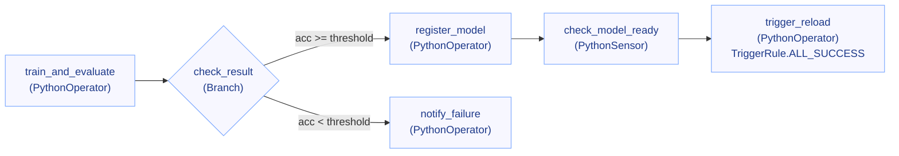
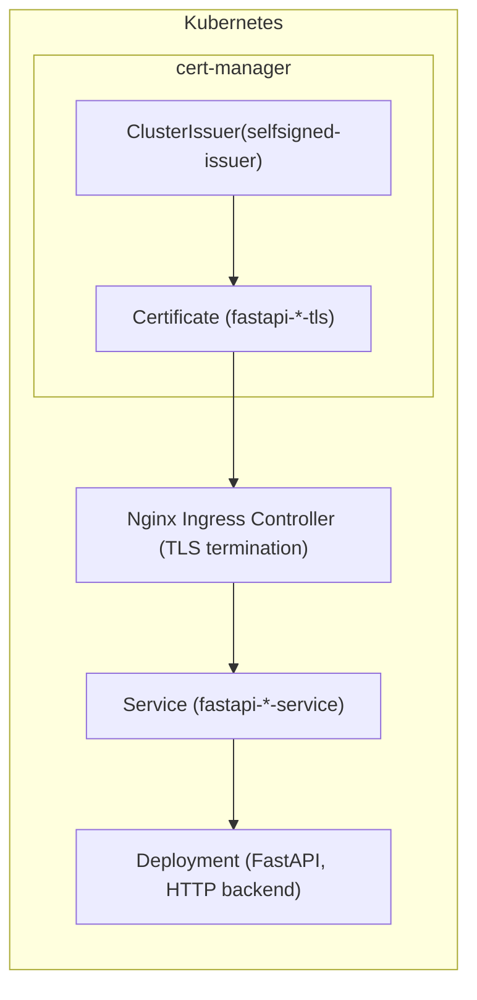

+++
date = '2025-08-18T17:11:21+09:00'
draft = false
title = '[MLOps 운영 고도화 - 5단계: Airflow 안정화 & FastAPI HTTPS 보안]'
categories = ['MLOps Pipeline', 'FastAPI', 'MLflow', 'Airflow', 'Kubernetes', 'Helm']
+++

## Airflow 안정화 & FastAPI HTTPS 보안 적용 (cert-manager 어노테이션 반영 완료)

---

## 🧠 시나리오 설명

> “모델을 등록하는 것보다 더 중요한 건
> 
> 
> **언제 Reload가 실행되느냐**입니다. 여기가 운영 안정성을 나누는 지점이니까요.”
> 
> “그래서 이번 단계에서는 Airflow 흐름을 한 번 더 단단히 조이고,
> 
> FastAPI 쪽은 HTTPS·화이트리스트까지 적용해
> 
> **‘안전하게 자동화된다’는 확신을 주는 구조**를 만들었습니다.”
> 

---

## 🎯 핵심 요약

- **Airflow**: `PythonSensor(mode="reschedule")`로 **READY 감시**, `TriggerRule.ALL_SUCCESS`로 **성공 체인에서만** `/reload`
- **데이터/상태 꼬임 방지**: Variable 검증 유틸 + XCom 키 표준
- **FastAPI**: Ingress **TLS(HTTPS) + IP 화이트리스트** 강화
- **cert-manager + ClusterIssuer(self-signed)** 자동 발급/갱신: **템플릿에 어노테이션 자동 주입 반영 완료**

---

## 5-1️⃣ Airflow 안정화: Sensor 리팩토링 & XCom/Variable 표준

### 1) DAG 구조



### 2) READY 감시 전용 센서

```python
# dags/ml_code/sensor_model_ready.py
import mlflow
from ml_code.config import get_mlflow_client
from airflow.utils.log.logging_mixin import LoggingMixin

logger = LoggingMixin().log

def check_model_ready(model_name: str, version: str) -> bool:
    client = get_mlflow_client()
    mv = client.get_model_version(name=model_name, version=version)
    logger.info(f"[Sensor] 상태 체크: {model_name} v{version} → {mv.status}")
    if mv.status == "READY":
        return True
    elif mv.status == "FAILED_REGISTRATION":
        raise RuntimeError("❌ 모델 등록 실패: 상태 FAILED_REGISTRATION")
    return False
```

### 3) DAG 본문(핵심 발췌) — **성공 체인 보장 & 표준화된 변수/XCom**

```python
# dags/dag_ml_train_register_reload.py
from airflow import DAG
from airflow.operators.python import PythonOperator, BranchPythonOperator
from airflow.sensors.python import PythonSensor
from airflow.utils.trigger_rule import TriggerRule
from airflow.exceptions import AirflowSkipException
from airflow.models import Variable
from datetime import datetime, timedelta
from pendulum import timezone

from ml_code.train_model import train_model
from ml_code.register_model import register_model
from ml_code.rollback_model import rollback_model
from ml_code.trigger_reload import trigger_reload
from ml_code.sensor_model_ready import check_model_ready
from utils.slack_alerts import send_slack_alert, alert_slack
from mlflow.tracking import MlflowClient

kst = timezone("Asia/Seoul")
default_args = {"start_date": datetime(2025, 1, 1, tzinfo=kst), "retries": 1, "retry_delay": timedelta(minutes=2)}

def get_param(key, default, cast_func, validate_func=None):
    try:
        value = cast_func(Variable.get(key, default=str(default)))
        if validate_func and not validate_func(value):
            raise ValueError("Validation failed")
        return value
    except Exception as e:
        send_slack_alert(f"[Param] {key} 로딩 실패: {e} → 기본값 {default} 사용")
        return default

def get_version_by_alias(model_name, alias):
    try:
        return MlflowClient().get_model_version_by_alias(model_name, alias).version
    except Exception:
        return None

def train_and_evaluate(ti, **_):
    C = get_param("logreg_C", 1.0, float, lambda x: 0.001 <= x <= 10.0)
    max_iter = get_param("logreg_max_iter", 200, int, lambda x: x > 50)
    threshold = get_param("accuracy_threshold", 0.9, float, lambda x: 0.5 <= x <= 0.99)
    model_name = Variable.get("model_name")
    alias = Variable.get("mlflow_alias")
    if not (model_name and alias):
        raise ValueError("필수 Variable 누락: model_name 또는 mlflow_alias")
    acc, run_id = train_model(C=C, max_iter=max_iter)
    if not run_id:
        raise ValueError("run_id 없음 → 학습 실패")
    for k, v in {"run_id": run_id, "model_name": model_name, "alias": alias, "acc": acc, "threshold": threshold}.items():
        ti.xcom_push(key=k, value=v)

def check_result(ti, **_):
    acc = ti.xcom_pull(task_ids="train_and_evaluate", key="acc")
    thr = ti.xcom_pull(task_ids="train_and_evaluate", key="threshold")
    if acc is None or thr is None:
        send_slack_alert("❌ check_result → XCom 누락")
        raise AirflowSkipException()
    return "register_model" if acc >= thr else "notify_failure"

def register_model_task(ti, **_):
    run_id = ti.xcom_pull(task_ids="train_and_evaluate", key="run_id")
    model_name = ti.xcom_pull(task_ids="train_and_evaluate", key="model_name")
    alias = ti.xcom_pull(task_ids="train_and_evaluate", key="alias")
    prev_version = get_version_by_alias(model_name, alias)
    try:
        version = register_model(run_id, model_name, alias)
        ti.xcom_push(key="version", value=version)
        send_slack_alert(f"✅ 모델 등록 완료: {model_name} v{version} → @{alias}")
    except Exception as e:
        msg = f"❌ 모델 등록 실패: {e}"
        if prev_version:
            rollback_model(model_name, prev_version, alias)
            msg += f" → 롤백 완료: v{prev_version}"
        else:
            msg += " → 롤백 생략"
        send_slack_alert(msg)
        raise

def sensor_ready_func(ti, **_):
    model_name = ti.xcom_pull(task_ids="train_and_evaluate", key="model_name")
    version = ti.xcom_pull(task_ids="register_model", key="version")
    return check_model_ready(model_name, version)

def trigger_reload_task(ti, **_):
    alias = ti.xcom_pull(task_ids="train_and_evaluate", key="alias")
    try:
        trigger_reload(alias)  # FastAPI 응답 {"status":"success", ...} 기대
        send_slack_alert(f"🔁 핫스왑 완료: @{alias}")
    except Exception as e:
        send_slack_alert(f"❌ 핫스왑 실패: {e}")
        raise

def notify_failure():
    send_slack_alert("⚠️ 기준 미달 → 등록 및 핫스왑 생략")

with DAG(
    dag_id="ml_train_register_and_reload",
    default_args=default_args,
    schedule=None,
    catchup=False,
    tags=["mlops", "train", "sensor", "reload"],
    on_failure_callback=alert_slack,
) as dag:
    train = PythonOperator(task_id="train_and_evaluate", python_callable=train_and_evaluate)
    branch = BranchPythonOperator(task_id="check_result", python_callable=check_result)
    register = PythonOperator(task_id="register_model", python_callable=register_model_task)
    sensor = PythonSensor(task_id="check_model_ready", python_callable=sensor_ready_func,
                          poke_interval=10, timeout=180, mode="reschedule")
    reload = PythonOperator(task_id="trigger_reload", python_callable=trigger_reload_task,
                            trigger_rule=TriggerRule.ALL_SUCCESS)  # ✅ 성공 체인에서만 실행
    failure = PythonOperator(task_id="notify_failure", python_callable=notify_failure,
                             trigger_rule=TriggerRule.NONE_FAILED_MIN_ONE_SUCCESS)

    train >> branch
    branch >> [register, failure]
    register >> sensor >> reload

```

**운영 포인트**

- 센서는 **reschedule**로 워커 슬롯 잠식 방지
- `/reload`는 **등록 + READY 센서** 모두 성공해야만 실행
- Variable 캐스팅/검증 실패는 **Slack 통지 + 안전 기본값**으로 진행
- XCom 키명: `run_id / model_name / alias / acc / threshold / version` 고정

---

## 5-2️⃣ FastAPI HTTPS & cert-manager 자동 발급 (어노테이션 자동 주입 반영 완료)

### 1) 구조



> TLS는 Ingress에서 종단(복호화)되고, 백엔드는 HTTP로 유지합니다.
> 
> 
> 인증서 발급·갱신은 cert-manager가 **ClusterIssuer(self-signed)** 를 통해 자동 처리합니다.
> 

### 2) Values(dev/prod) — 실환경 값과 일치

```yaml
# charts/fastapi/values/dev.yaml (발췌)
ingresses:
  - name: fastapi-local
    host: fastapi.local
    className: nginx
    whitelist: 192.168.18.0/24
    paths:
      - path: /
        pathType: Prefix
    tls:
      enabled: true
      secretName: fastapi-dev-tls
      issuerName: selfsigned-issuer
```

```yaml
# charts/fastapi/values/prod.yaml (발췌)
ingresses:
  - name: fastapi-prod
    host: fastapi.prod
    className: nginx
    whitelist: 192.168.18.0/24
    paths:
      - path: /
        pathType: Prefix
    tls:
      enabled: true
      secretName: fastapi-prod-tls
      issuerName: selfsigned-issuer
```

### 3) Ingress 템플릿 — **어노테이션 자동 주입**

> tls.issuerName이 설정되면 cert-manager 어노테이션이 자동으로 주입됩니다.
> 

```yaml
# charts/fastapi/templates/fastapi-ingress.yaml (핵심부)
{{- range .Values.ingresses }}
---
apiVersion: networking.k8s.io/v1
kind: Ingress
metadata:
  name: {{ $.Release.Name }}-{{ .name }}
  annotations:
    nginx.ingress.kubernetes.io/whitelist-source-range: "{{ .whitelist }}"
    nginx.ingress.kubernetes.io/ssl-redirect: "true"
{{- if and .tls .tls.enabled .tls.issuerName }}
    cert-manager.io/cluster-issuer: "{{ .tls.issuerName }}"
{{- end }}
spec:
  ingressClassName: {{ $.className | default "nginx"}}
  rules:
    - host: {{ .host }}
      http:
        paths:
{{- range .paths }}
          - path: {{ .path }}
            pathType: {{ .pathType }}
            backend:
              service:
                name: {{ $.Values.service.name }}
                port:
                  number: {{ $.Values.service.port }}
{{- end }}
{{- if and .tls .tls.enabled }}
  tls:
    - hosts:
        - {{ .host }}
      secretName: {{ .tls.secretName }}
{{- end }}
{{- end }}
```

### 4) ClusterIssuer (공통 1회)

```yaml
# one-time
apiVersion: cert-manager.io/v1
kind: ClusterIssuer
metadata:
  name: selfsigned-issuer
spec:
  selfSigned: {}
```

### 5) 검증

```bash
# 리소스 확인
kubectl get clusterissuer
kubectl -n fastapi-dev get certificate
kubectl -n fastapi-dev get secret | grep fastapi-dev-tls

# Ingress에 어노테이션 반영 여부
kubectl -n fastapi-dev get ing -o yaml | grep -A3 annotations:

# HTTPS 응답(로컬/테스트)
curl -vkI https://fastapi.local --resolve fastapi.local:443:<LB_IP>
```

**정상 지표**

- `SSL certificate verify ok`(self-signed는 로컬 신뢰 이슈로 경고 가능)
- 응답 헤더 `server: nginx`, Ingress 레벨에서 200/404 응답

---

## ✅ 체크리스트

- [ ]  Airflow `PythonSensor(mode="reschedule")` 적용
- [ ]  `/trigger_reload`는 `TriggerRule.ALL_SUCCESS`로 **성공 체인 전용**
- [ ]  `get_param()` 유틸로 Variable **검증/캐스팅/Slack 통지**
- [ ]  XCom 키 표준: `run_id / model_name / alias / acc / threshold / version`
- [ ]  **Ingress 템플릿에 cert-manager 어노테이션 자동 주입(반영 완료)**
- [ ]  dev/prod 별 **host / secretName / whitelist / issuerName** 값 일치 확인

---

## 🧩 팁

| 증상 | 원인 | 해결 |
| --- | --- | --- |
| Sensor 타임아웃 | READY 미도달 | 모델 등록 실패 로그 확인, 파라미터/데이터 재점검 |
| Reload가 먼저 실행 | TriggerRule 누락 | `/trigger_reload`를 `ALL_SUCCESS`로 고정 |
| 인증서 Pending | cert-manager 이벤트 오류 | `kubectl describe certificate`로 원인 확인, 
Issuer/어노테이션 재검 |
| SAN 불일치 경고 | host 변경 잔존 | 해당 `Certificate` 삭제 → cert-manager 자동 재발급 |
| 403 접근 거부 | 화이트리스트 불일치 | `nginx.ingress.kubernetes.io/whitelist-source-range` 대역 확인 |

---

## 🏁 정리

> Airflow는 Sensor + 성공 체인 트리거로 신뢰도를 끌어올리고,
> 
> 
> FastAPI는 **Ingress TLS + 화이트리스트**에 **cert-manager 자동 발급**까지 더해 운영 보안을 단단히 했습니다.
> 
> 이제 “**등록 → READY → Reload**”가 **정상 케이스에서만** 반영되는 **안정 루프**가 완성
>
