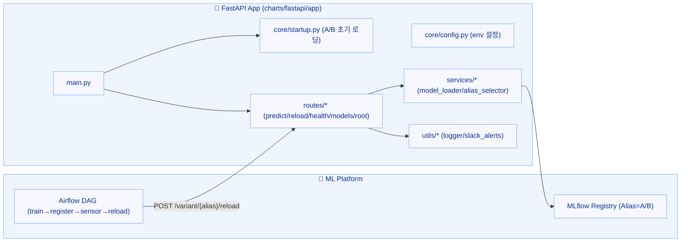

+++
date = '2025-08-27T17:10:21+09:00'
draft = false
title = '[MLOps 운영 고도화 - 6단계: GitOps 고도화 (Argo CD·MetalLB·ApplicationSet)]'
categories = ['MLOps Pipeline', 'Kubernetes', 'Helm', 'Git', 'Network']
+++

## FastAPI 앱 전면 개편: A/B · Canary · Blue-Green 서빙 베이스

---

## 🧠 시나리오 설명

> “운영 환경에서 모델은 언제든 교체될 수 있고,
> 
> 
> 그 순간이 서비스 품질이 가장 크게 흔들리는 위험 구간입니다.”
> 
> “그래서 이번 단계에서는 이후 모든 자동화(학습·등록·핫스왑·롤백)의 기반이 되는
> 
> **A/B · Canary · Blue-Green 전략을 모두 처리할 수 있는 FastAPI 서빙 구조**부터 잡았습니다.”
> 
> “이 뼈대가 완성돼야 Airflow, MLflow, ArgoCD와 연결된
> 
> **진짜 ‘운영형 MLOps 파이프라인’**을 만들 수 있기 때문입니다.”
> 

---

### 🎯 핵심 요약

- **전환 기준 = MLflow Alias(@A/@B)**
    
    (`models:/<name>@<alias>` + `get_model_version_by_alias`)
    
- **MLflow 서비스 FQDN**
    - dev: `http://mlflow-dev-service.mlflow-dev.svc.cluster.local:5000`
    - prod: `http://mlflow-prod-service.mlflow-prod.svc.cluster.local:5000`
- **Ingress 보안 키**: `nginx.ingress.kubernetes.io/whitelist-source-range`
- **헬스 체크**: `ok / degraded / unhealthy` 3단계 상태 완전 구현

> 이후 1~9단계 모든 실습은 이 구조를 공통 베이스로 사용합니다.
> 
> 
> ArgoCD, Airflow, MLflow, FastAPI가 완전 동기화된 GitOps 기반 MLOps 운영 구조입니다.
> 

---

## 1️⃣ 전체 구조 요약



---

## 2️⃣ 코드 트리

```
charts/fastapi/app/
├─ main.py
├─ core/
│  ├─ config.py
│  └─ startup.py
├─ routes/
│  ├─ health.py
│  ├─ models.py
│  ├─ predict.py
│  ├─ reload.py
│  └─ root.py
├─ services/
│  ├─ alias_selector.py
│  └─ model_loader.py
└─ utils/
   ├─ logger.py
   └─ slack_alerts.py
```

> 전체 코드는 레포에 있습니다 (에필로그 참고)
> 

---

## 3️⃣ 핵심 변경 요약

- **자동/수동 분리**
    
    `/predict` → 자동 분기(A/B/Canary/Blue-Green)
    
    `/variant/{alias}/predict` → 수동 지정(A/B)
    
- **핫스왑 구조 표준화**
    
    `/variant/{alias}/reload` → `x-token` 인증 + Slack + 로그(NFS)
    
- **기동 시 자동 로딩**
    
    `A/B` 동시 로딩 → 일부 실패 `degraded`, 전부 실패 `unhealthy`
    
- **상태 관리**
    
    `/health` 3단계 + `/models` 메타정보 제공
    

---

## 4️⃣ 엔드포인트 요약

| 메서드 | 경로 | 설명 |
| --- | --- | --- |
| `POST` | `/predict` | `x-client-id` 기반 자동 분기 |
| `POST` | `/variant/{alias}/predict` | alias 지정 예측 (A/B) |
| `POST` | `/variant/{alias}/reload` | 모델 핫스왑 (`x-token` 인증 필요) |
| `GET` | `/health` | 헬스 상태 (ok/degraded/unhealthy) |
| `GET` | `/models` | 현재 로딩 모델 정보 |
| `GET` | `/` | 전체 엔드포인트 인덱스 |

---

## 5️⃣ 보안 & 로깅

- **보안**
    - `/variant/{alias}/reload`: `x-token == RELOAD_SECRET_TOKEN` 일치 시에만 수행
    - Ingress 내부망 화이트리스트 + TLS 적용
- **로깅**
    - `loguru` 기반 파일 로그 → PVC (`/app/logs/fastapi.log`)
- **알림**
    - Slack Webhook (성공/실패/헬스 상태 템플릿화)

---

## 6️⃣ 동작 예시

```bash
# ✅ 수동 예측 (A)
curl -k -X POST https://fastapi.local/variant/A/predict \
  -H "Content-Type: application/json" \
  -d '{"data": [[5.1,3.5,1.4,0.2]]}'

# ✅ 자동 예측 (x-client-id 기반)
curl -k -X POST https://fastapi.local/predict \
  -H "x-client-id: client_88" \
  -H "Content-Type: application/json" \
  -d '{"data": [[5.1,3.5,1.4,0.2]]}'

# ✅ 모델 핫스왑 (B)
curl -k -X POST https://fastapi.local/variant/B/reload \
  -H "x-token: <RELOAD_SECRET_TOKEN>"
```

> -k 옵션은 self-signed 인증서용 테스트 플래그입니다.
> 

---

## 7️⃣ 체크리스트

- [ ]  `ALIAS_SELECTION_MODE` = `"ab_test" | "canary" | "blue_green"`
- [ ]  `/variant/{alias}/reload` 토큰 확인 (`RELOAD_SECRET_TOKEN`)
- [ ]  Ingress 화이트리스트 (`nginx.ingress.kubernetes.io/whitelist-source-range`)
- [ ]  Slack Secret (dev/prod 분리)
- [ ]  PVC 권한 (`fsGroup`, `runAsUser`)
- [ ]  MLflow Alias(@A/@B) 기반 전환 로직

---

## 8️⃣ 교차 검증 결과

- **dev env**
    - `ALIAS_SELECTION_MODE=blue_green`, `DEFAULT_ALIAS=B`, `CANARY_PERCENT=20`
    - `MLFLOW_TRACKING_URI=http://mlflow-dev-service.mlflow-dev.svc.cluster.local:5000`
- **분배 로그**
    - `ab_test_result.log` 500건 전량 B → Blue-Green + DEFAULT_ALIAS=B 정상 동작
- **PVC**
    - `fastapi-logs-pvc-dev/prod` 둘 다 Bound 상태 확인

---

## 9️⃣ 대표 코드 스냅샷

### (1) `services/alias_selector.py`

```python
import hashlib
from core.config import settings

def get_alias(client_id: str | None) -> str:
    mode = settings.alias_selection_mode

    if mode == "blue_green":
        return settings.default_alias

    if not client_id:
        return settings.default_alias

    hashed = int(hashlib.sha256(client_id.encode()).hexdigest(), 16)
    bucket = hashed % 100

    if mode == "ab_test":
        return "A" if bucket < 90 else "B"
    elif mode == "canary":
        return "B" if bucket < settings.canary_percent else "A"
    else:
        return settings.default_alias
```

### (2) `routes/predict.py`

```python
from fastapi import APIRouter, Header, HTTPException, Request
import pandas as pd
from services.alias_selector import get_alias
from core.config import settings
from utils.logger import logger
from utils.slack_alerts import send_slack_alert

router = APIRouter()

@router.post("/predict")
async def predict(request: Request, input_data: dict, x_client_id: str | None = Header(default=None)):
    models = getattr(request.app.state, "models", {})
    if not models:
        raise HTTPException(status_code=503, detail="모델 미로딩 상태")

    alias = get_alias(x_client_id)
    model_entry = models.get(alias)
    if not model_entry:
        raise HTTPException(status_code=503, detail=f"모델 {alias} 미로딩 상태")

    try:
        df = pd.DataFrame(input_data.get("data", []))
        prediction = model_entry["model"].predict(df)
        logger.info(f"[Predict] alias={alias}, mode={settings.alias_selection_mode}, client_id={x_client_id}")
        return {"variant": alias, "mode": settings.alias_selection_mode, "prediction": prediction.tolist()}
    except Exception as e:
        logger.exception("예측 실패")
        send_slack_alert(f"❌ 예측 실패 (alias={alias}): {e}")
        raise HTTPException(status_code=500, detail="예측 처리 중 오류")
```

### (3) `services/model_loader.py`

```python
import mlflow.pyfunc
from mlflow.tracking import MlflowClient
from utils.slack_alerts import send_slack_alert
from loguru import logger
from core.config import settings

def load_model_by_alias(alias: str):
    try:
        mlflow.set_tracking_uri(settings.mlflow_tracking_uri)
        client = MlflowClient()
        model_uri = f"models:/{settings.model_name}@{alias}"
        model = mlflow.pyfunc.load_model(model_uri)
        version_info = client.get_model_version_by_alias(settings.model_name, alias)

        logger.info(f"✅ 모델 로딩 성공: alias={alias}, version={version_info.version}")
        return {
            "model": model,
            "info": {
                "model_name": settings.model_name,
                "alias": alias,
                "version": version_info.version,
                "run_id": version_info.run_id,
                "model_uri": model_uri,
            }
        }
    except Exception as e:
        logger.error(f"❌ 모델 로딩 실패: {e}")
        send_slack_alert(f"❌ 모델 로딩 실패: alias={alias}, {e}")
        return None
```

### (4) `routes/health.py`

```python
from fastapi import APIRouter, Request

router = APIRouter()

@router.get("/health")
def health_check(request: Request):
    models = getattr(request.app.state, "models", {})
    if not models:
        return {"status": "unhealthy", "loaded": []}

    missing = [v for v in ["A", "B"] if v not in models]
    if missing:
        return {"status": "degraded", "loaded": list(models.keys()), "missing": missing}

    return {"status": "ok", "loaded": list(models.keys())}
```

---

## 🔟 Helm 주요 값

### ▶ dev

```yaml
env:
  MLFLOW_TRACKING_URI: "http://mlflow-dev-service.mlflow-dev.svc.cluster.local:5000"
  MODEL_NAME: "best_model"
  DEFAULT_ALIAS: "B"
  ALIAS_SELECTION_MODE: "blue_green"
  CANARY_PERCENT: "20"
```

### ▶ prod

```yaml
env:
  MLFLOW_TRACKING_URI: "http://mlflow-prod-service.mlflow-prod.svc.cluster.local:5000"
  MODEL_NAME: "best_model"
  DEFAULT_ALIAS: "B"
  ALIAS_SELECTION_MODE: "blue_green"
  CANARY_PERCENT: "10"
```

---

## 🧩 팁

- 🧩 **Secret 이름 일치성**: `envFrom.secretRef.name` ↔ 실제 Secret `metadata.name`
- 🔧 **Blue-Green 모드에서는 `CANARY_PERCENT` 미사용**
- 🔧 **기동 실패 시 즉시 종료(sys.exit)** → Health 노이즈 차단

---

## 🧭 검증 명령 모음

```bash
# FastAPI env 확인
kubectl -n fastapi-dev exec $(kubectl -n fastapi-dev get po -l app=fastapi-dev -o name | head -1) -- \
printenv | egrep 'ALIAS_SELECTION_MODE|DEFAULT_ALIAS|CANARY_PERCENT|MLFLOW_TRACKING_URI|MODEL_NAME'

# MLflow 서비스 DNS 확인
kubectl -n mlflow-dev  get svc mlflow-dev-service  -o wide
kubectl -n mlflow-prod get svc mlflow-prod-service -o wide

# Ingress 화이트리스트 확인
kubectl -n fastapi-dev get ing -o yaml | egrep 'ingressClassName|whitelist-source-range|host:'

# 헬스 상태 확인
curl -sk https://fastapi.local/health
```

---

## 🏁 정리

> FastAPI의 A/B/Canary/Blue-Green 구조가 Helm, MLflow, Slack, PVC, ArgoCD와 완전 동기화되었습니다.
> 
> 
> Ingress, Secrets, MLflow Alias까지 모두 실환경 기준으로 검증 완료되었습니다.
>
