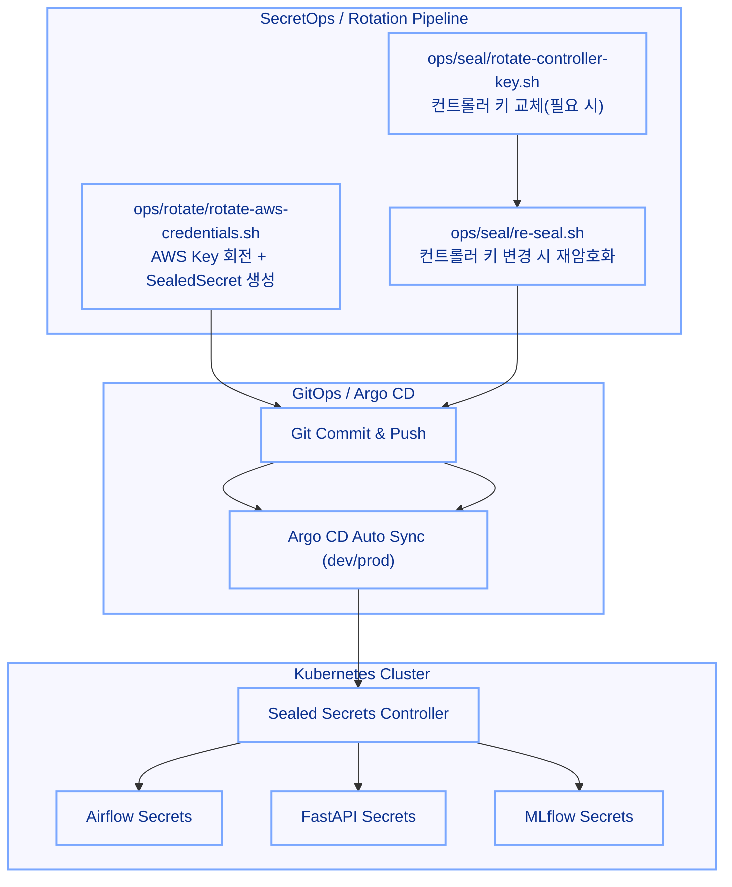

+++
date = '2025-09-25T17:10:21+09:00'
draft = false
title = '[MLOps 운영 고도화 - 9단계: 시크릿 관리 & 키 회전 자동화 (AWS·SealedSecret)]'
categories = ['MLOps Pipeline', 'Kubernetes', 'Helm', 'Git', 'CI/CD', 'Security', 'GitOps(ArgoCD)']
+++

## 시크릿 관리 및 키 회전 자동화: AWS Credentials · SealedSecret Re-Seal

---

## 🧠 시나리오 설명

> “MLOps에서는 모델보다 먼저, ‘비밀’이 먼저 무너집니다.”
> 
> 
> “특히 AWS 키처럼 **주기적으로 교체해야 하는 값**은 자동화가 필요하지만,
> 
> JWT·Slack Webhook처럼 **교체 시 영향이 큰 값**은 운영자가 직접 결정해야 합니다.”
> 
> “그래서 9단계에서는
> 
> **‘자동화할 것과 사람이 확인해야 할 것을 구분한 SecretOps 체계’를 확립하는 것**이 목적이었습니다.”
> 
> “AWS 키 회전·SealedSecret 재암호화·GitOps 반영까지는
> 
> **필요한 작업들을 스크립트로 묶어 반복을 최소화**했고,
> 
> 운영자가 ‘언제 실행할지’만 결정하면 되도록 정리했습니다.”
> 

---

## 🎯 핵심 요약

- **AWS IAM Access Key 주기 회전** → Airflow / FastAPI / MLflow에 **GitOps 자동 반영**
- **SealedSecrets 재암호화(Re-Seal)** 로 컨트롤러 키 교체에도 **무중단 운영**
- “**보안 리스크는 자동화**, **변경 영향 큰 건 수동**”의 균형 운영
- **Rotation/Re-Seal 스크립트 실행 후** → Git Commit/Push → Argo CD Sync로 이어지는 **반자동 보안 GitOps 루틴**

---

### 1️⃣ 전체 구조 요약



---

### 2️⃣ AWS Credentials Rotation (반자동)

### 실행 예시

```bash
# dev 환경
bash ops/rotate/rotate-aws-credentials.sh dev

# prod 환경
bash ops/rotate/rotate-aws-credentials.sh prod
```

### 동작 흐름

1. 현재 IAM 사용자/기존 키 확인
2. **새 AccessKey/Secret 생성** → `/root/backup`에 0600로 백업
3. `envs/<env>/sealed-secrets/{airflow,fastapi,mlflow}/sealed-aws-credentials-<env>-secret.yaml` 갱신
4. `git add/commit/push` → Argo CD **Auto Sync**
5. 정상성 검증 후 **이전 키 Inactive → Delete**

---

### 3️⃣ SealedSecret Re-Seal (컨트롤러 키 변경 대응)

> 평문은 건드리지 않고, 기존 암호문만 클러스터의 최신 공개키로 재암호화합니다.
> 

### 실행 예시

```bash
# 변경만 미리 확인 (파일 diff만 생성)
DRY_RUN=1 bash ops/seal/re-seal.sh dev

# 실제 반영
bash ops/seal/re-seal.sh dev
```

### 동작 흐름

1. 현재 컨트롤러 공개키 fingerprint 확인
2. `kubeseal --re-encrypt`로 **모든 SealedSecret 재암호화**
3. 레포 파일 교체 `git commit/push` & Argo CD **Auto Sync**로 무중단 적용

### 안전 장치

- 스크립트에 **필수 가드** 권장
    - 컨트롤러 이름/네임스페이스 확인: `-controller-name sealed-secrets --controller-namespace kube-system`
    - 대상 디렉터리 화이트리스트: `envs/<env>/sealed-secrets/**`
    - 작업 전/후 git **clean/safe-state** 확인

---

### 4️⃣ 컨트롤러 키 자체 교체 (필요 시)

> rotate-controller-key.sh 로 sealed-secrets 컨트롤러 키를 재발급/교체하고, 즉시 Re-Seal까지 연동합니다.
> 

### 실행 예시

```bash
# 교체 → 전체 재암호화 → 커밋/푸시까지 원샷 (환경별)
bash ops/seal/rotate-controller-key.sh dev
```

### 권장 순서

1. **백업**: 기존 컨트롤러 시크릿 dump
2. **교체**: sealed-secrets 컨트롤러 키 재발급
3. **검증**: 새 공개키 fingerprint 출력
4. **Re-Seal 호출**: `ops/seal/re-seal.sh <env>` 자동 호출
5. **GitOps**: 커밋/푸시 → Argo CD Auto Sync
6. **관찰**: 대상 앱 OutOfSync/에러 없음 확인

> 컨트롤러 키 교체는 드물지만 큰 변경입니다. 가급적 근무 시간 + Slack 알림 활성화 상태에서 수행하세요.
> 

---

### 5️⃣ 기타 시크릿 운영 방침(수동 루틴 유지)

| 항목 | 회전 방식 | 이유 |
| --- | --- | --- |
| Slack Webhook | 수동 | 잘못 교체 시 관제 단절 위험 |
| FastAPI JWT Secret | 수동 | 토큰 무효화 영향 큼 |
| Git SSH Key | 수동 | git-sync 인증 실패 리스크 |
| DB Password | 수동 | 변경 주기 낮고 영향 범위 큼 |

> 원칙: 자주 바뀌고 위험한 건 자동화, 가끔 바뀌고 영향 큰 건 수동 검증.
> 

---

### 6️⃣ 향후 확장 가능

| 목표 | 방법 |
| --- | --- |
| K8s-native 외부 비밀 연동 | **External Secrets Operator(ESO)** |
| 관리형 스토어 사용 | **AWS Secrets Manager** + IAM Role |
| 완전 무중단 | 동일 Secret 이름 유지 + 공급자만 교체 |

> 지금의 GitOps/Argo CD는 그대로 두고 비밀 공급자만 교체하는 식으로 자연스럽게 승급 가능.
> 

---

### 7️⃣ 체크리스트

- [ ]  `rotate-aws-credentials.sh` 실행 후 **Secret 리소스 버전 증가**(describe/events)
- [ ]  서비스 **S3/레지스트리 접근 정상**(403 없음)
- [ ]  구 Access Key **Inactive → Delete** 완료
- [ ]  컨트롤러 교체/업그레이드 후 반드시 **`re-seal.sh` 수행**
- [ ]  Argo CD **Auto Sync** 정상 + Drift 없음
- [ ]  (선택) Helm에 **`checksum/secret`** 반영해 자동 롤아웃 확인

---

### 8️⃣ 팁

| 증상 | 원인 | 해결 |
| --- | --- | --- |
| “Max 2 keys” 에러 | IAM 키 2개 초과 | 오래된 키 삭제 후 재시도 |
| OutOfSync 반복 | SealedSecret만 수정, 워크로드 롤아웃 미발생 | **체크섬 어노테이션** 또는 수동 `rollout restart` |
| 403 접근 오류 | Pod에 구 키 남아있음 | 롤아웃 트리거/재배포 |
| 복호화 실패 | 컨트롤러 키 변경 후 Re-Seal 미수행 | `bash ops/seal/re-seal.sh <env>` 실행 |

---

### 9️⃣ GitOps 연동 관점 보강(운영 편의)

- **디렉터리 표준화**
    - `envs/<env>/sealed-secrets/<app>/sealed-*.yaml`
- **Sync Wave/Order**
    - Secret/Config는 `sync-wave: "-1"`, 워크로드는 `sync-wave: "0"~"1"`

---

### ✅ 요약

| 영역 | 자동화 | 스택 |
| --- | --- | --- |
| AWS Key Rotation | 자동 | AWS CLI, kubeseal, Argo CD |
| Re-Seal | 반자동 | kubeseal (re-encrypt), git |
| Controller Key 교체 | 반자동 | 스크립트 + Re-Seal + GitOps |
| 기타 시크릿 | 수동 | kubectl + kubeseal |
| 확장 | 선택 | ESO / AWS Secrets Manager |

---

### 🏁 정리

> AWS Key Rotation과 SealedSecret 재암호화 과정을
> 
> 
> **스크립트 기반으로 표준화해**
> 
> 운영자가 “필요할 때 실행하고 GitOps로 반영하는”
> 
> **의도 기반 SecretOps 체계**를 만들었습니다.
> 
> 반복적으로 번거롭던 보안 작업을 **표준화하고, 절차를 자동화**해
> 
> dev/prod 환경 양쪽에서 **일관된 보안 GitOps 흐름**을 갖추는 것이 핵심 목표였습니다.
>
