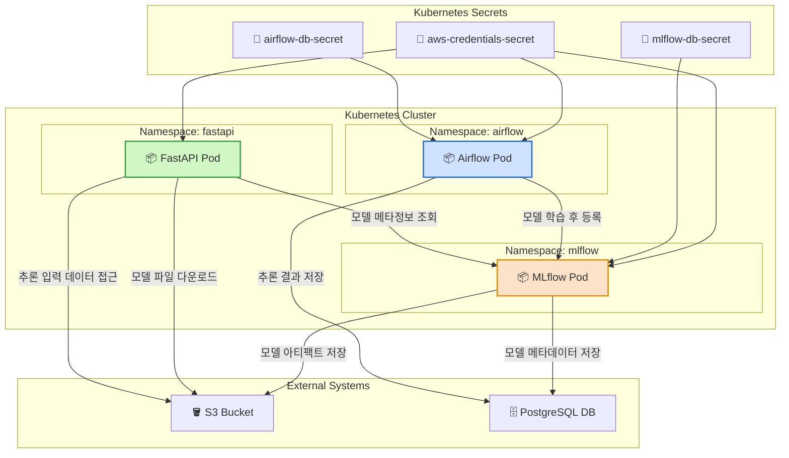

+++
date = '2025-07-15T17:55:05+09:00'
draft = false
title = '[MLOps 플랫폼 구축 : Airflow-MLflow-FastAPI (Helm)]'
categories = ['MLOps Pipeline', 'Airflow', 'MLflow', 'FastAPI', 'NFS', 'PostgreSQL', 'AWS', 'Kubernetes', 'Helm', 'Git']
+++

## 📌 전체 시리즈 요약

| 순서 | 주제 |
| --- | --- |
| 1 | [🔗 실습을 위한 인프라 사전 구성 (Kubernetes, NFS, PostgreSQL, S3 등)](https://keonhoban.github.io/mlops-journey/posts/mlops-pipeline-helm/01/) |
| 2 | [🔗 Secret/보안 구성 및 Kubernetes 연동](https://keonhoban.github.io/mlops-journey/posts/mlops-pipeline-helm/02/) |
| 3 | [🔗 MLflow Tracking 서버 및 Registry 구축](https://keonhoban.github.io/mlops-journey/posts/mlops-pipeline-helm/03/) |
| 4 | [🔗 Airflow DAG Git 연동 및 Secret 기반 구성](https://keonhoban.github.io/mlops-journey/posts/mlops-pipeline-helm/04/) |
| 5 | [🔗 FastAPI 모델 서빙 & MLflow 모델 자동 로딩](https://keonhoban.github.io/mlops-journey/posts/mlops-pipeline-helm/05/) |
| 6 | [🔗 Airflow + MLflow + FastAPI 연결을 통해 모델 핫스왑](https://keonhoban.github.io/mlops-journey/posts/mlops-pipeline-helm/06/) |

---

## 💡 지금까지 구현한 아키텍처 요약

- **Kubernetes 기반 Pod로 모든 구성 요소 운영**
- **Secret 기반 AWS 인증 정보 및 DB 정보 주입**
- **Ingress 기반 접근 (ex. airflow.local, mlflow.local, fastapi.local)**
- **MLflow + Airflow + FastAPI 연계로 실시간 모델 관리/서빙 자동화**

---

## 🎯 실무 관점에서 강점

| 항목 | 내용 |
| --- | --- |
| 모델 실험 자동화 | Airflow DAG + MLflow 연동으로 다양한 모델 버전 학습 자동화 |
| 서빙 안정성 | FastAPI가 `Production` Stage 기준으로 모델 로드 → 무중단 핫스왑 가능 |
| 보안 구성 | AWS 인증 정보 및 DB 정보는 Secret으로 주입 |
| 인프라 이식성 | Helm + Docker + Kubernetes 기반 → 어디서든 이식 가능 |
| 실시간 추론 확인 | Ingress 기반 UI/Endpoint 연결 → 바로 curl 테스트 가능 |

---

## 🔍 회고

### ✅ 프로덕션 환경 고려

- 운영 가능한 MLOps 구조로 설계 (유지보수/보안 고려)
- AWS S3, PostgreSQL, Kubernetes, GitOps까지 현실 환경 가정하고 구성
- Secret 설계, Volume 마운트, GitSync, 커스텀 이미지 등 세세한 부분까지 설계 주도

### ✅ 자동화 기반 설계

- Airflow를 통해 모델 학습 → Registry 등록 → 서빙까지 자동화
- 모델 핫스왑 실험까지 성공적으로 구현

---

## 🧱 부족했던 점 & 보완 계획

| 항목 | 개선 포인트 |
| --- | --- |
| 모니터링 | Prometheus + Grafana로 서빙/실험 성능 모니터링 추가 필요 |
| 모델 테스트 자동화 | pytest + CI 파이프라인 구성으로 품질 확보 고려 |
| Kubeflow 연계 | Kubeflow Pipelines 및 Katib 등과의 비교 분석 예정 |
| Terraform 기반 전환 | Helm 구성 요소를 코드로 관리하는 Terraform 인프라 전환 계획 |

---

## 📈 다음 단계 설계

| 기간 | 목표 |
| --- | --- |
| 2025년 8월 | Kubeflow 기반 재구성 + 모델 자동 튜닝 실험 |
| 2025년 9월 | Triton Inference Server 연동 + GPU 서빙 실습 |
| 2025년 10월 | ScyllaDB & LLM 서빙 구조 실험 |
| 연말 | MLOps 포트폴리오 정리 및 지원서 작성 |

---

## ✨ 마치며

이번 시리즈는 단순한 학습이 아니라, 설계에 대해 고민하며

많은 시도 끝에 **MLOps 인프라를 직접 설계하고 구현한 기록**입니다!

운영을 고려한 아키텍처 설계, 자동화된 실험 → 서빙 흐름 구축,

그리고 무엇보다 “**스스로 설계하고 검증하며 구성했다는 자신감**”이

이 시리즈의 가장 큰 성과라고 생각합니다 ㅎㅎ

만약 피드백 주실 부분이 있다면 편하게 말씀부탁드립니다 감사합니다~!

---

## 🙌 프로젝트 GitHub 저장소

- GitHub 코드: [[Helm] Airflow + MLflow + FastAPI](https://github.com/keonhoban/mlops-infra-labs/tree/main/airflow_mlflow_fastapi_helm)
