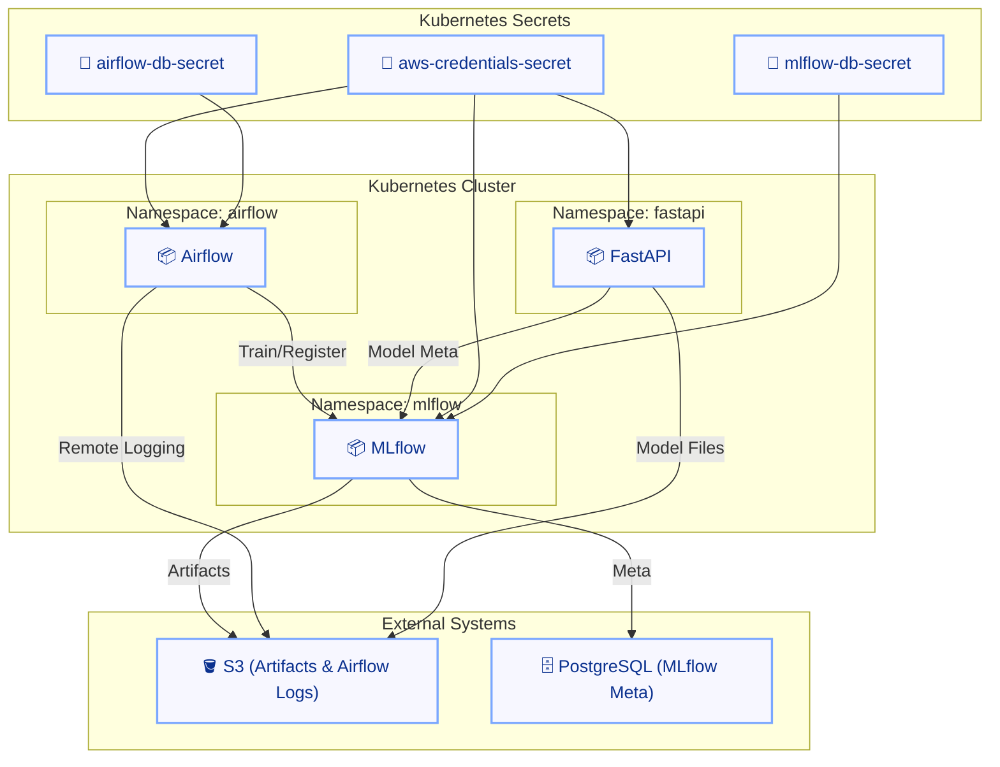
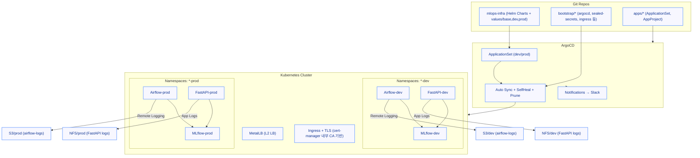
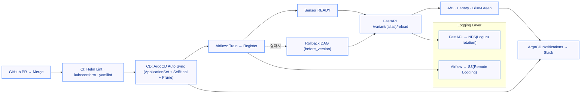

+++
date = '2025-10-13T17:10:21+09:00'
draft = false
title = '[MLOps 운영 고도화 - 에필로그]'
categories = ['MLOps Pipeline', 'Kubernetes', 'Git', 'GitOps(ArgoCD)', 'CI/CD', 'Security', 'Observability', 'Architecture']
+++

## 에필로그 — “한 번의 커밋으로 끝까지 가는 자율형 MLOps 플랫폼”

---

## 📌 전체 경로 요약

| 순서 | 주제 |
| --- | --- |
| 0 | [🔗 FastAPI A/B·Canary·Blue-Green 서빙 베이스](https://keonhoban.github.io/mlops-journey/posts/mlops-platform-gitops/01/) |
| 1 | [🔗 핫스왑 고도화 (/reload 보안·DAG 자동화)](https://keonhoban.github.io/mlops-journey/posts/mlops-platform-gitops/02/) |
| 2 | [🔗 Slack Alert 통합 (FastAPI·Airflow 공용)](https://keonhoban.github.io/mlops-journey/posts/mlops-platform-gitops/03/) |
| 3 | [🔗 모델 롤백 자동화 (등록 실패 대비 복구)](https://keonhoban.github.io/mlops-journey/posts/mlops-platform-gitops/04/) |
| 4 | [🔗 FastAPI 로그 안정화 (NFS + PV/PVC + Loguru)](https://keonhoban.github.io/mlops-journey/posts/mlops-platform-gitops/05/) |
| 5 | [🔗 Airflow 안정화 & FastAPI HTTPS 보안](https://keonhoban.github.io/mlops-journey/posts/mlops-platform-gitops/06/) |
| 6 | [🔗 GitOps 고도화 (Argo CD·MetalLB·ApplicationSet)](https://keonhoban.github.io/mlops-journey/posts/mlops-platform-gitops/07/) |
| 7 | [🔗 Argo CD Notifications 자동화 (Slack 연동)](https://keonhoban.github.io/mlops-journey/posts/mlops-platform-gitops/08/) |
| 8 | [🔗 CI/CD 운영 자동화 (GitHub Actions·Helm Lint)](https://keonhoban.github.io/mlops-journey/posts/mlops-platform-gitops/09/) |
| 9 | [🔗 시크릿 관리 & 키 회전 자동화 (AWS·SealedSecret)](https://keonhoban.github.io/mlops-journey/posts/mlops-platform-gitops/10/) |

---

---

## 🎯 전체 내용 요약 (0~9단계)

| 단계 | 핵심 목표 | 주요 개선점 |
| --- | --- | --- |
| 0 | FastAPI 리뉴얼 | `/predict`(자동) · `/variant/{alias}/predict`(수동) · `/variant/{alias}/reload`(핫스왑) 
→ **A/B·Canary·Blue-Green 통합 라우팅 구조** |
| 1 | 핫스왑 보안/자동화 | `/reload` 토큰 인증 + Ingress 화이트리스트 + TLS, 
**Airflow Sensor READY 후 Reload 트리거** |
| 2 | Slack Alert 통합 | **FastAPI/Airflow 공용 `send_slack_alert()`**, Airflow 실패 콜백 Slack 알림 |
| 3 | 롤백 자동화 | 등록 실패 시 **before_version** 명시 롤백, READY 검증 + FastAPI `/reload` 자동 반영 |
| 4 | 로그 안정화 | **FastAPI=Loguru+NFS(PV/PVC)** / **Airflow=S3 업로드**, 
권한(fsGroup/runAsUser)·보관 주기 표준화 |
| 5 | Airflow 안정화·HTTPS | `PythonSensor(reschedule)`·`ALL_SUCCESS`·XCom Key 고정, 
**cert-manager 기반 TLS 자동화 (내부 CA)** |
| 6 | GitOps 전환 | **MetalLB + SealedSecret + ApplicationSet** 기반 자동 배포 체계 구축 |
| 7 | GitOps 모니터링 | **ArgoCD Notifications → Slack** 실시간 Sync/Health 관제 |
| 8 | CI/CD 고도화 | **Helm Lint(strict) + kubeconform + yamllint** 매트릭스 검증, 
“PR→Merge→Auto Deploy→실험” 자동화 |
| 9 | SecretOps 표준화 | **AWS Key Rotation / Re-Seal 반자동화(스크립트 기반)**, GitOps 기반 
**“Secrets as Code” 운영 체계**  |

> 🔄 핵심
> 
> 
> “Git 커밋 한 번으로 학습→등록→배포→실험→모니터링→복구까지 자율 순환한다.”
> 

---

## ⚙️ Helm 기준선 구조 (Before GitOps)

**Before 특징**

- `helm upgrade` 기반 수동 배포.
- Secret 수동 생성 (`kubectl create secret ...`).
- Airflow 로그는 **S3 업로드**, FastAPI는 **NFS(PV/PVC)** 보존.
- 인증서: prod은 `letsencrypt-prod` 표기를 사용했지만, **내부 hosts 기반 self-signed와 실질 동일**.

---

## 🧩 GitOps 전환 후 (After)

> Helm 템플릿 구조를 유지하면서, ArgoCD로 배포·보안·관제를 자동화.
> 

**After 특징**

- **Helm values 패턴 그대로 유지**
- **환경별 Namespace 완전 분리** → dev/prod 동시 운영 안정화
- **Airflow=S3 Remote Logging**, **FastAPI=NFS(Loguru rotation)** 유지
- **cert-manager 내부 CA 기반 TLS 자동화** — hosts 기반 내부 신뢰망으로 외부 노출 없이 폐쇄형 TLS 운영
- **ArgoCD ApplicationSet** 으로 dev/prod 자동 배포 + SelfHeal
- **SealedSecret + Rotation/Re-Seal** 로 Key 관리 완전 자동화
- **스토리지(PV/PVC)** 는 워크로드와 **생명주기 분리**: **전용 Application(Prune=false, Replace=false)** 로 관리해 데이터 보존과 안전한 드리프트 감시

---

## 🔍 Helm → GitOps 변화 요약

| 영역 | Helm (Before) | GitOps (After) | 의미 |
| --- | --- | --- | --- |
| 배포 방식 | 수동 `helm upgrade` | ArgoCD Auto Sync | 자동화·SelfHeal |
| Secret 관리 | kubectl 수동 | SealedSecret + Rotation/Re-Seal | “Secrets as Code” |
| 로그 | FastAPI=NFS / Airflow=S3 | FastAPI=NFS 유지 / Airflow=S3 일원화 | 이원화 표준화 |
| 인증서 체계 | `cert-manager + LE 표기 (실질 self-signed)` | **cert-manager 내부 CA 기반 자동 TLS (hosts 기반 내부 신뢰망)** | 외부 CA 없이 자동 갱신 
+ 공격 표면 최소화 |
| CI/CD | 수동 빌드 | GitHub Actions + ArgoCD Pipeline | “PR→배포→Slack” 일원화 |
| 관제 | 개별 알림 | ArgoCD Notifications + Slack | 실시간 관제 일원화 |
| 네임스페이스 | 단일 | 환경별 분리 | 격리·복구 용이 |
| 스토리지(PV/PVC) | 수동 `kubectl apply` | 전용 App + prune=false + replace=false | 데이터 보존·수명주기 분리 |

> 수동 빌드·배포에서 벗어나, PR → CI → ArgoCD → Slack → 실험으로 이어지는 자동화된 “One Commit Flow” 완성.
> 

---

## 🔁 One Commit Flow

---

## 🧠 운영 원칙

- **보안/시크릿** → AWS Key Rotation + Re-Seal 완전 자동화
- **배포 안정성** → Sensor READY 이후 Reload, 실패 시 롤백 자동 반영
- **로그 구조** → Airflow=S3 / FastAPI=NFS, 권한·보관·로테이션 일원화
- **TLS 체계** → cert-manager 내부 CA 자동 갱신, hosts 기반 내부 신뢰망 운영
- **GitOps 복원력** → ApplicationSet + SelfHeal + Prune로 OutOfSync 자동 복구
- **스토리지 분리** → PV/PVC는 **전용 ArgoCD App**으로 운영(※ **Prune/Replace 비활성**으로 데이터 안전성 확보)

---

## ✅ 점검 체크리스트

- [ ]  Airflow S3 Prefix(dev/prod) 정상 기록
- [ ]  FastAPI `/app/logs` NFS 권한 일치(fsGroup/runAsUser)
- [ ]  cert-manager 내부 CA 기반 TLS 정상 발급
- [ ]  SealedSecret Rotation + Re-Seal 정상 동작
- [ ]  ApplicationSet dev/prod Path 정합성
- [ ]  Slack 알림 정상 동작
- [ ]  **스토리지 전용 App**이 **`prune=false`, `replace=false`** 로 설정되어 있음

---

## 🏁  회고

> 이제 모든 빌드·배포·관제는 GitOps 루프 안에서 자동으로 순환합니다.
> 
> 
> 장애 시 자동 복구되고, 변경은 즉시 반영되며, 운영자는 단지 **커밋 한 번**으로 플랫폼 전 과정을 제어합니다.
> 
> **Helm의 구조 위에 GitOps 운영 계층을 쌓아, 자율형 MLOps를 구현했습니다.**
>

## 🙌 프로젝트 GitHub 저장소

- GitHub 코드: [[GitOps] mlops-platform](https://https://github.com/keonhoban/mlops-infra-labs/tree/main/mlops-platform)

